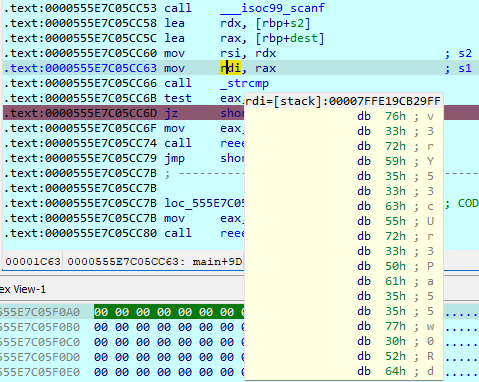

# REad thE linES Writeup

### Tools
* A disassembler (I used IDA)
* Linux VM for remote debugging

The program asks for password when ran, I assumed giving the correct password will yield the flag

### First Part of the flag
First part of the flag can be found using the following command on Linux
```
user@acer-server:~/tools/ida_working$ strings REadthElinES | grep "LNC2022"
LNC2022{D1d_y0u88553s!!
```

### Second part
There are total of 2 checks to pass before you can get the flag, we first need to get the correct password.
To do this first find main and look for the first jump instruction that is the result of the strcmp() for the password.
Set at breakpoint at said jump instruction and start the debugging process

 \
As you can see here after entering a password the breakpoint is triggered
 \
The correct password can be found in the stack, Focus on the instructions here \
 \
The two values needed for the strcmp are loaded into the rsi and rdi registers before strcmp is called \
 \
 \
RSI points to the values entered by the user, RDI contains the correct password \
You can see the correct password is **v3rY53cUr3Pa55w0Rd** \
Notice a difference now, good! However, it still says wrong password, to find out why investigate further \
 \
There are alot of reee functions in the program to confuse the human,
Switching to pseudocode view for easier navigation \
 \
The correct password leads us to the reee70 function.  Here we can see the other check we must fulfil to continue.
However, the check is impossible to pass as it will always evaluate to false, running the reee45 function which leads us to the `Wrong Password!` prompt \
 \
To pass this check we would need to patch the binary so that the program will always skip the jump instruction and continue execution.
to run the reee67 function.
```c
int reee67()
{
  int result; // eax
  char v1[11]; // [rsp+5h] [rbp-Bh] BYREF

  strcpy(v1, "=bHSA?q");
  while ( *(int *)&v1[7] <= 6 )
  {
    result = putchar(v1[*(int *)&v1[7]] ^ 0xC);
    ++*(_DWORD *)&v1[7];
  }
  return result;
}
```

After patching the binary to change the jnz instruction to jz
We can now bypass the second check. \
Running the patched binary now with the password **v3rY53cUr3Pa55w0Rd** will yield the second part of the flag `_F1nD_M3}` \
 \
Tne full flag is `LNC2022{D1d_y0u88553s!!_F1nD_M3}`
